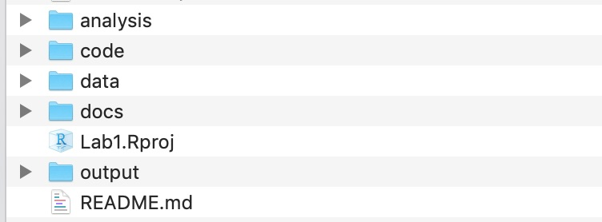
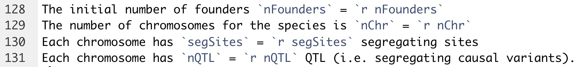

  
<style>
pre {
  overflow-x: auto;
}
pre code {
  word-wrap: normal;
  white-space: pre;
}
</style>

```{r setup, include=FALSE}
knitr::opts_chunk$set(echo=TRUE)
knitr::opts_chunk$set(message=FALSE)
knitr::opts_chunk$set(cache=FALSE)
```

# Preliminaries

## Pre-preparation

If you rate your familiarity with R as "low" please go to [Data Carpentry: R for Genomics](http://www.datacarpentry.org/R-genomics/) *in advance* of the first class and do the following: 

* Work through the material between *at minimum* chapters 1 ("Before We Start") and 4 ("Data frames"), but preferably also 5 ("The dplyr package").
* This website includes instructions for installing R and Rstudio and *basic* instruction on how to interact with R.
* Please install the `AlphaSimR`, `workflowr`, and `tidyverse` packages.

## Learning objectives
1. Reproducible scripting
  i) A reproducible analysis workflow includes a predictable input file and data structure, and outputs that are described, interpreted, and put in the context of the overall project in English.  
  ii) The audience of this workflow is akin to someone who might be reviewing a manuscript derived from the work. The **most important audience is yourself, six months later**, or your close collaborators (e.g., lab group) who may need to carry on the work after you move on.  
  iii) Whether you like it or not, you are a computational biologist. Lab biology experiments need to be reproducible. Computational biology analyses need to be reproducible.  
2. R markdown and workflowr  
  i) R markdown language. It allows you to mingle script with formatted text, with script outputs.  Note that Python and c++ scripts can be incorporated into R markdown.  
  ii) `workflowr` aims to make it easier to follow a coding workflow that will increase the communicability and reproducibility of your code, and constrain you somewhat to following that workflow. The package sets up a standard directory file structure and populates it with useful initial R markdown (.Rmd) files.  
  iii) `workflowr` also sets up the directory as a git version control repository. We will (probably) not teach git, but we encourage you all delving into it. Assume for the purpose of this class that you can use `workflowr` just to set up the file structure.
  
There [is more](https://cran.r-project.org/web/packages/workflowr/vignettes/wflow-01-getting-started.html) you can do with the package, and it's worth checking it out (and its extensive documentation!)  
3. AlphaSimR  
  i) AlphaSimR is a package to simulate breeding populations and tasks. It is not completely intuitive nor completely well-documented. We will get started with it here. It should help for future homework  
4. Homework  
  i) Labs, including this one, will be coupled with homework. One possibility for homework will be to do it in a `workflowr`-created directory, and hand in that zipped directory, or, if you go further and create a website out of it, just send in the URL...  

## Document explanation
There are three components to this document:
1. Discussing "Reproducible Programming" and various practices and packages that can help out.  
2. Writing a simple `AlphaSimR` script and describing it.  
3. Setting up a homework.  
In principle, we should cover the ideas of the homework in class. You will then make a clean rmarkdown script to show the ideas. The rmarkdown script can be embedded in a `workflowr` directory if you want. The questions to answer through the lab and homework will be indented text.  

> This is indented text

## Further background
* R markdown is very good for documenting **scripts**, but less so **programs**. If code is linear and fairly simple, I call it a script.  If code has loops, is potentially multi-purpose, and defines functions, I call it a program. `workflowr` provides a `code` directory for programs, and an `analysis` directory for scripts. Of course, scripts can (should) refer to functions, etc., in the `code` directory. Any raw data can go in `data`. Script outputs can go in `output`. Final figures and so on can go in `docs`.  
* If you write a series of functions that you will use repeatedly, it's probably worth [making a package](http://r-pkgs.had.co.nz/) out of them.  That is not trivial, but it's less difficult than it sounds.  You do not have to submit your package to **CRAN**, but can just use it internally.  The documentation of functions that goes along with making a package is very helpful over time.  
* If you write a program that you imagine will develop over time, learn version control (probably "git".  I don't know any other version control...), [here](https://guides.github.com/activities/hello-world/) or [here](https://www.atlassian.com/git).  Note that a public repository like github can be quite useful for making your data available once you publish your research. Note too that `workflowr` commands wrap a number of git commands to simplify the work flow, particularly if you are working in the RStudio environment.    
* Here are some useful articles:
  i) [Ten Simple Rules for Reproducible Computational Research](http://journals.plos.org/ploscompbiol/article?id=10.1371/journal.pcbi.1003285)  
  ii) [Good enough practices in scientific computing](http://journals.plos.org/ploscompbiol/article?id=10.1371/journal.pcbi.1005510)
  iii) [Creating and sharing reproducible research code the workflowr way](https://f1000research.com/articles/8-1749/v1)

---

# Simulating some classical results
This script uses `AlphaSimR` to simulate the "outbreak of variation" that arises when you self-fertilize a hybrid.  

## Loading packages
If your script depends on external packages, load them at the beginning. This shows users early on what the script dependencies are.  
```{r package ambiguity, message=TRUE}
ip <- installed.packages()
packages_used <- c("AlphaSimR", "tidyverse", "workflowr")

for (package in packages_used){
  isInstalled <- package %in% rownames(ip)
  if (!isInstalled){
    stop(paste("ERROR: you need to install the", package, "package"))
  } else{
    library(package, character.only=T)
  }
}#END packages_used
```

A first thing to notice from the output of loading tidyverse is the conflicts report.  In particular, for example, two packages (`dplyr` and `stats`) have been loaded that have a function called `filter`. Since dplyr was loaded *after* stats, if you use the function `filter`, it will go to the dplyr version by default.  It is dangerous to rely on what order packages have been loaded to determine which `filter` function you get.  R syntax to prevent ambiguity is to write either `dplyr::filter` or `stats::filter`.  Using that syntax will make your code more reproducible.

## Document packages used
This chunk creates a "README.md" file that documents the packages and versions used for future reference.
```{r document packages}
source("code/addToREADME.R")
addToREADME(paste0("## ", rmarkdown::metadata$title), append=F)
addToREADME(c(date(), ""))

packages_used <- as_tibble(ip[packages_used, c("Package", "Version", "Built")])
# Clunky way to add the packages at the end
readme_file <- ".addToReadMe.txt"
write_tsv(packages_used, readme_file)
```
Hyperlink the [README file](../README.md) to the report.  That makes is easy to find.  

## Set random seed
AlphaSimR generates many random numbers (e.g., to simulate Mendelian random segregation).  If you want the result of the analysis to come out the same each time (there are pros and cons) you need to set the random seed. Note that `workflowr` does this by default. If you are not using that package, then be explicit.  
```{r set random seed}
random_seed <- 45678
set.seed(random_seed)
addToREADME(paste("The random seed is", random_seed))
```

## Script parameters
If the behavior of your script depends on parameters that you set, initialize them early on.
```{r simulation parameters}
nFounders <- 100
nChr <- 10 # Number of chromosomes
segSites <- 1000 # Number of segregating sites _per chromosome_
nQTL <- 10 # Vary this parameter to get oligo- versus poly- genic traits
```

## Executable descriptions
It is easy for text descriptions around your code to become out of sync with the code.  Because the descriptions are ignored by the computer during execution, they may say one thing while the script says another.  That becomes confusing later when you revisit the script.  One way to avoid that is "executable descriptions".  For example, rather than setting parameters in a chunk of code, you can set them "inline" in R markdown:  
The initial number of founders `nFounders` = `r nFounders`  
The number of chromosomes for the species is `nChr` = `r nChr`  
Each chromosome has `segSites` = `r segSites` segregating sites  
Each chromosome has `nQTL` = `r nQTL` QTL (i.e. segregating causal variants).  


## Parameters to README  
This is starting to look **VERY** redundant, but it can't hurt to have the information in multiple places.  Chunks of code like this do not need to be included in the report.  To exclude them use the "include=FALSE" option in the chunk.
```{r paramter to readme}
addToREADME(c(
  paste("The number of founders for the simulation is", nFounders), 
  paste("The number of chromosomes is", nChr), 
  paste("There are", nQTL, "QTL per chromosome"),
  paste("There are", segSites, "segregating sites per chromosome")
  ))
addToREADME(c("", "The packages used in this script are:"))
addToREADME(readLines(readme_file))
```

## AlphaSimR populations
The basic object of `AlphaSimR` is the population. To make founders, you first make founder haplotypes from a coalescent simulation, then you define simulation parameters that will link their genetic variation to phenotypic variation, then you make a first diploid population from the founder haplotypes.
```{r Make founder population}
# Create haplotypes for founder population of outbred individuals
# Note: default effective population size for runMacs is 100
founderHaps <- runMacs(nInd=nFounders, nChr=nChr, segSites=segSites)

# New global simulation parameters from founder haplotypes
SP <- SimParam$new(founderHaps)
# Additive and dominance trait architecture
# By default, the genetic variance will be 1
SP$addTraitA(nQtlPerChr=nQTL)

# Create a new population of founders
founders <- newPop(founderHaps, simParam=SP)
str(founders)
```

## Population information
The population has `id`s. The `@mother` and `@father` ids are all zero because this population was made from founder haplotypes, and so does not have diploid parents. The genotypic values `gv` of the population are calculated for the trait created using `SP$addTraitA(nQtlPerChr=nQTL)`. Given that there are `r nChr` chromosome`r ifelse(nChr > 1, "s", "")` and `r nQTL` QTL per chromosome, there are `3^(nChr*nQTL)` = `r 3^(nChr*nQTL)` different possible genotypic values. These genotypic values are accessible with the function `gv(founders)`

From here, you can treat this population like a named vector using the square braces extraction operator `[ ]`.  Extract individuals by their `@id` or just by their order in the population using an integer index. For example, pick three random individuals from a population and list their ids. Pick the one with the first id in alphabetical order.  
```{r Population extraction operator}
test <- founders[sample(nFounders, 3)]
testID <- test@id
firstInd <- test[order(testID)[1]]
print(testID)
print(firstInd)
print(firstInd@id)
```

## Outbreak of variation
In the early 20th century, Emerson and East showed that if you crossed to inbreds, the hybrid had similar variation to each inbred, but if you then selfed the hybrid, the offspring varied substantially. This code simulates that result. First, self the founders to homozygosity. The function `self` self-fertilizes individuals from the population. By default, it creates one selfed individual per parent (controllable with the parameter `nProgeny`), so this works nicely for single-seed descent.  
```{r Self founders}
# Self-pollinate to for a few generations
nGenSelf <- 4
inbredPop <- founders
for (gen in 1:nGenSelf){
  inbredPop <- self(inbredPop)
}
```

## Check homozygosity
Just a sanity check that this has, in fact, created a population of 100 individuals that are appropriately homozygous.  Loci are coded 0, 1, 2. So `qtl == 1` represents the case were a locus is heterozygous. `sum(qtl == 1)` counts those cases.  
```{r Check homozygosity}
qtl <- pullQtlGeno(inbredPop)
if (nrow(qtl) != nFounders) stop("The number of individuals is unexpected")
if (ncol(qtl) != nChr * nQTL) stop("The number of QTL is unexpected")
fracHet <- sum(qtl == 1) / (nFounders * nChr * nQTL)
cat("Expected fraction heterozygous", 1 / 2^nGenSelf, "\n",
    "Observed fraction heterozygous", fracHet, "+/-", 
    round(2*sqrt(fracHet*(1-fracHet)/(nFounders*nChr*nQTL)), 3), "\n")
```

> What was wrong with my reasoning about the Expected fraction heterozygous?

## Simulate outbreak of variation
Just for fun, we will pick the pair of most average or most extreme inbred individuals, in terms of their genetic value, cross thpse pairs, then self-fertilize them to test their variation. We will assume a trait that has a heritability of 0.5 in the base, non-inbred population population. In practice, that means an error variance of 1. Here, I pick the average pair by finding the order and picking two in the middle. I pick the extreme pair by finding the order and picking the first and last.  
```{r Pick average or extreme pairs}
indGVs <- gv(inbredPop)
averageInd <- inbredPop[order(indGVs)[50:51]]
extremeInd <- inbredPop[order(indGVs)[c(1, nFounders)]]
```

## Cross the pair to make F1 hybrid
The crossPlan is a **two-column matrix** with as many rows as the number of crosses you want to make, the first column is the `@id` or the index of the seed parent, and likewise for the pollen parent in the second column.  To make an F1, you just want to make one cross, so the matrix is one row. You just want to cross individual 1 with individual 2, so the row contains 1:2.  
```{r Make hybrids}
crossPlan <- matrix(1:2, nrow=1, ncol=2)
f1_average <- makeCross(averageInd, crossPlan)
f1_extreme <- makeCross(extremeInd, crossPlan)
```

## Make F2 and observe phenotypic variance
When you first make a population, `AlphaSimR` does not assume it has been phenotyped. You can phenotype it using the `setPheno` function.  Note that if you use `setPheno` on the same population a second time, that will overwrite the phenotypes from the first time. I also print the genotypic variance that can be retrieved using the function `varG`. Really, `varG` gives all we need to know, but of course that variance is generally not observable in non-simulated reality.  
```{r Make F2}
f2_average <- self(f1_average, nProgeny=100)
f2_average <- setPheno(f2_average, varE=1)
cat("Genotypic variance of F2 between average pair", round(varG(f2_average), 3))
hist(pheno(f2_average), main="Histogram of Average-Pair F2 Phenotypes")
f2_extreme <- self(f1_extreme, nProgeny=100)
f2_extreme <- setPheno(f2_extreme, varE=1)
cat("Genotypic variance of F2 between extreme pair", round(varG(f2_extreme), 3))
hist(pheno(f2_extreme), main="Histogram of Extreme-Pair F2 Phenotypes")
```

## Observe F1 phenotypic variance
We only made a single F1 plant.  `AlphaSimR` can't give that plant different phenotypes. So to pretend to be Emerson and East, we have to make, say, 100 F1 individuals. I will do this just for the f1_extreme case. Here, varG may or may not be zero, depending on how many generations of selfing you did.  
```{r Make many hybrids}
crossPlan <- matrix(1:2, nrow=100, ncol=2, byrow=T)
f1_extremeMany <- makeCross(extremeInd, crossPlan)
f1_extremeMany <- setPheno(f1_extremeMany, varE=1)
cat("Genotypic variance of F1 between extreme pair", round(varG(f1_extremeMany), 3))
hist(pheno(f1_extremeMany), main="Histogram of Extreme-Pair *F1* Phenotypes")
```

> What conditions will tend to make the outbreak of variation under the "average" scenario similar to the "extreme" scenario?
